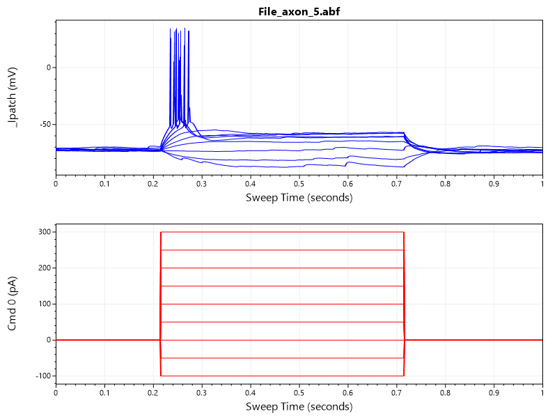

#  AbfSharp
[](https://dev.azure.com/swharden/swharden/_build/latest?definitionId=5&branchName=master)
[](https://www.nuget.org/packages/AbfSharp/)
[](LICENSE)

**AbfSharp is a .NET Standard library for reading electrophysiology data from Axon Binary Format (ABF) files.** 

`AbfSharp.ABF` is a .NET native ABF file reader written entirely in C# so it can be used in 32-bit or 64-bit projects in any environment (including Linux and MacOS).

`AbfSharp.ABFFIO.ABF` has the same API but works by wrapping ABFFIO.DLL (the official closed-source ABF file reading library). Although this DLL can only be used in 32-bit projects that target Windows, this module makes it easy to access to "official" ABF header and sweep data values in .NET environments.

<div align="center">
  
</div>

Consistent with the [Semantic Versioning Specification](https://semver.org), AbfSharp's major version number is zero meaning its API may change as this project continues to evolve.

## Quickstart

```cs
// Read an ABF using the AbfSharp's native reader
var abf = new AbfSharp.ABF("File_axon_5.abf");
float[] sweep = abf.GetSweep(0);
for (int i = 0; i < 5; i++)
    Console.Write($"{sweep[i]:0.000}, ");
```

```
-71.051, -71.057, -71.051, -71.063, -71.069,
```

If you are on Windows, target x86, and have ABFFIO.DLL in your output folder, you can read ABFs using the official ABFFIO library. The API is effectively identical and the output is the same:

```cs
// Read an ABF using the official ABFFIO.DLL reader
var abf = new AbfSharp.ABFFIO.ABF("File_axon_5.abf");
float[] sweep = abf.GetSweep(0);
for (int i = 0; i < 5; i++)
    Console.Write($"{sweep[i]:0.000}, ");
```

### Plot Sweep Data with C#

[ScottPlot](https://swharden.com/scottplot) can be used to graph sweep data (and stimulus waveforms). See sample source code in the tests folder for a demonstration of how to create plots like this using the latest API:



## DLL Requirements

Although the `AbfSharp.ABF` module can read ABF files on any platform that supports .NET, using the official file reader (ABFFIO.DLL) to extract header and sample data from ABF files with `AbfSharp.ABFFIO.ABF` requires some extra considerations:

* **Your system must have dependencies installed:** The easiest way to ensure you have the DLLs that ABFFIO.DLL depends on is to [**download and install pClamp**]([pCLAMP](https://support.moleculardevices.com/s/article/Axon-pCLAMP-11-Electrophysiology-Data-Acquisition-Analysis-Software-Download-Page)). Attempting to use AbfSharp without these dependencies will produce a runtime error: `Unable to load DLL (Module could not be found HRESULT: 0x8007007E)`

* **Your project must target x86:** ABFFIO.DLL is only available as a 32-bit binary for Windows, and a 64-bit application cannot directly use resources in a 32-bit DLL. Using AbfSharp in an executable built targeting another platform will produce a runtime error: `System.BadImageFormatException: Could not load file or assembly 'AbfSharp, Version=1.0.0.0, Culture=neutral, PublicKeyToken=null'. An attempt was made to load a program with an incorrect format.`

## Resources
* [pyABF](https://swharden.com/pyabf) - a pure-Python interface for ABF files
* [phpABF](https://github.com/swharden/phpABF) - a pure-PHP interface for reading header data from ABF files
* [The ABF File Format](https://swharden.com/pyabf/abf2-file-format/) - extensive documentation about the format of data in binary ABF files
* [ABF-SDK on GitHub](https://github.com/swharden/ABF-SDK) - a collection of code and resources for working with ABF files