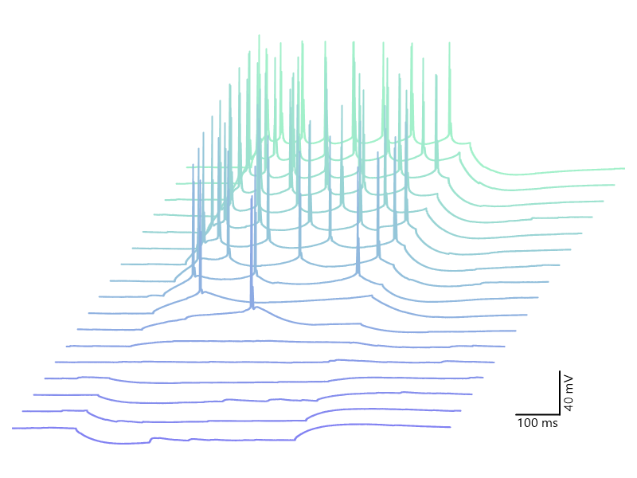
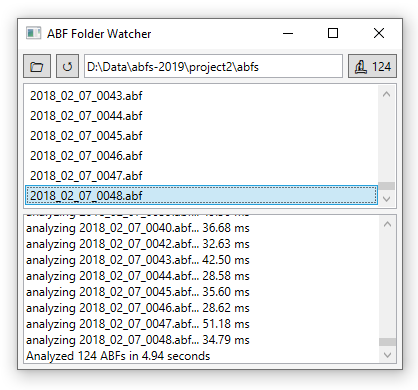
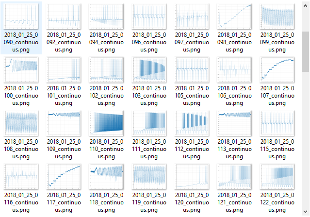
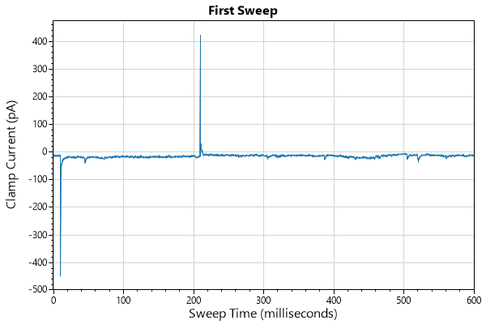
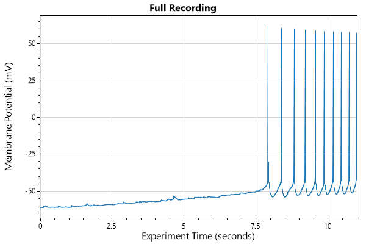
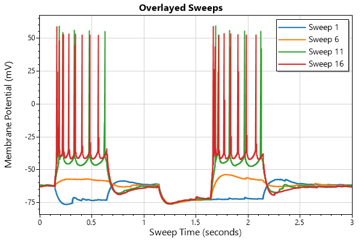
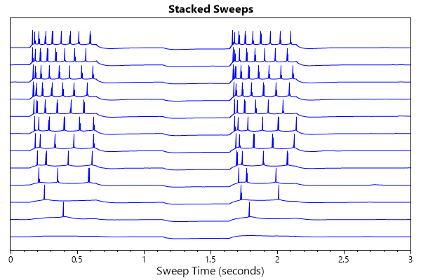

# ABFsharp
[](https://dev.azure.com/swharden/swharden/_build/latest?definitionId=5&branchName=master)

**ABFsharp is a .NET library that makes it easy to read electrophysiology data from Axon Binary Format (ABF) files.** ABFsharp wraps ABFFIO.DLL (the official C library provided to interface ABF files) and handles the low-level calls so you can focus on writing ABF analysis software using expressive code and modern language paradigms.

<div align="center">



_This plot was created with a few lines of C# using ABFsharp and the [ScottPlot](http://swharden.com/scottplot/) package ([view source](https://github.com/swharden/ABFsharp/blob/28526f3551576ea2aec4882f1ffda8c7744656b0/src/ABFsharp.Tests/Plot.cs#L138-L150))_

</div>

> **⚠️ WARNING:** This project is being actively developed (April 2020) and is not ready for use in production environments. Future breaking API changes are likely until this project stabilizes.

## Supported Platforms

ABFsharp targets .NET Standard so it can be used in .NET Framework and .NET Core applications.

ABFsharp wraps ABFFIO.DLL which is a closed source, Windows-only, 32-bit x86 DLL. Therefore, ABFsharp can only be used on Windows and cannot be used in 64-bit applications. One day I may create a 64-bit wrapper, but this is not yet available.

Developers interested in learning more about reading data from ABF files directly in 64-bit and cross-platform environments may find useful resources in the [pyABF](https://github.com/swharden/pyABF) project.

## Automated Analysis

ABFsharp can be used to develop automated analysis pipelines. An example application is included which automatically analyzes folders of ABF files, using hints from their data, header, tag comments, and protocol to ideally analyze each ABF and save the output as an image. This program seeks to mimic functionality of [pyABFauto](https://github.com/swharden/pyABFauto), a similar auto-analysis pipeline for Python.

ABF Folder Watcher | Auto-Analysis Output
---|---
|

## ABFsharp API

This section summarizes how ABFsharp reads and exposes ABF data, which is surprisingly different from the underlying ABFFIO library it wraps. Unlike ABFFIO's calling routines which rely on internal state and special sequences of internal method calls, the ABFsharp library favors immutability and statelessness.

* The entire ABF file is read into memory when the `ABF` object is instantiated. This avoids the file-locking behavior typically associated with applications that use ABFFIO (like ClampFit).

* Header values are stored in the `ABF` and are immutable.

* Methods are used to request data, and all data is returned as new `Trace` objects which contain duplicated mutable data.

* `Trace` objects have have `values`, a `sampleRate`, `commandValues`, `units`, `commandUnits`, etc. All values of `Trace` objects are mutable, but mutating their data does not affect data in the `ABF` that created them.

The ABFFIO library can only load one sweep into memory at a time. In contrast, ABFsharp loads all sweeps into memory at once. Data is cloned and loaded into `Trace` objects as it is requested. This means ABFsharp uses more memory than ABFFIO, but also that ABFsharp is extremely fast in comparison because it doesn't have to read data from the hard disk every time data for a sweep is requested. It also means ABFsharp is safer to use than ABFFIO because you cannot unintentionally mutate the source data. Finally, this model lends itself to multi-threaded analysis routines.

How much memory does ABFsharp require? A 1-hour 20kHz recording has 72 million points. Storing these as double (64-bit) values, that's 576 MB. Even if the memory requirement is doubled due to an architecture that favors immutability, any modern computer will handle this without concern.

## Quickstart

These examples demonstrate how to use ABFsharp in combination with [ScottPlot](http://swharden.com/scottplot/) to perform common ABF plotting tasks. Examples code is wrapped in supportive statements like these:

```cs
var abf = new ABFsharp.ABF("file.abf");
var plt = new ScottPlot.Plot();

/* ABF interaction and plotting code */

plt.AxisAuto(0);
plt.Title("Exciting Data");
plt.YLabel("Vertical Axis Label");
plt.XLabel("Horizontal Axis Label");
plt.SaveFig("file.png");
```

### Plot Sweep

_Gap-free recordings are treated as episodic recordings with a single sweep_

```cs
var trace = abf.GetSweep(0);
plt.PlotSignal(trace.values, trace.sampleRate);
```



### Plot Full Recording

```cs
var trace = abf.GetAllSweeps();
plt.PlotSignal(trace.values, trace.sampleRate);
```



### Overlay Sweeps
```cs
for (int i=0; i<abf.sweepCount; i++) {
    var trace = abf.GetSweep(i);
    plt.PlotSignal(trace.values, trace.sampleRate, lineWidth: 2);
}
plt.Legend();
```



### Stacked Sweeps
```cs
for (int i=0; i<abf.sweepCount; i++) {
    var trace = abf.GetSweep(i);
    plt.PlotSignal(trace.values, trace.sampleRate,
        color: Color.Blue, yOffset: i * 120);
}
plt.Grid(false);
plt.Ticks(displayTicksY: false);
```

