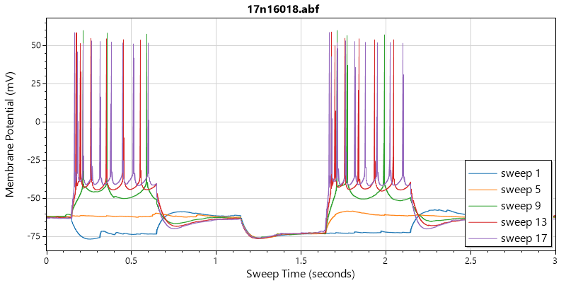

# ABFsharp
[](https://dev.azure.com/swharden/swharden/_build/latest?definitionId=5&branchName=master)
[](https://dev.azure.com/swharden/swharden/_build/latest?definitionId=5&branchName=master)

ABFsharp is a .NET library that makes it easy to read electrophysiology data from Axon Binary Format (ABF) files.

_WARNING: This project is very early in development and not ready for public use. Those interested in learning more about reading data from ABF files are encouraged to visit the [pyABF](https://github.com/swharden/pyABF) project._

## Quickstart



```cs
var abf = new ABFsharp.ABF("17n16018.abf");
var plt = new ScottPlot.Plot(800, 400);

for (int i = 0; i < abf.info.sweepCount; i += 4)
{
    abf.SetSweep(i);
    plt.PlotSignal(abf.sweep.valuesCopy, abf.info.sampleRate, label: $"sweep {i + 1}");
}

plt.Title(abf.info.fileName);
plt.YLabel("Membrane Potential (mV)");
plt.XLabel("Sweep Time (seconds)");
plt.Legend();
plt.AxisAuto(0);
plt.SaveFig("quickstart.png");
```
