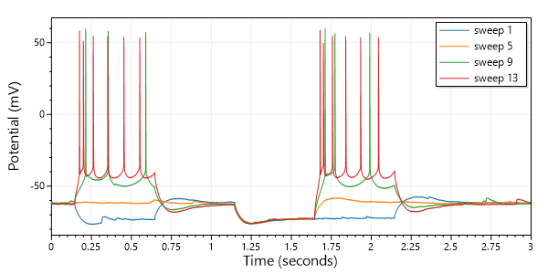

# AbfSharp
[](https://dev.azure.com/swharden/swharden/_build/latest?definitionId=5&branchName=master)

**AbfSharp is a .NET Standard library for reading electrophysiology data from Axon Binary Format (ABF) files.** AbfSharp wraps ABFFIO.DLL (the official closed-source library) and provides a simple .NET interface, handling low-level calls and memory management so you can focus on writing ABF analysis code.

<div align="center">
  
</div>

### Project Status

**⚠️ AbfSharp is pre-release** (version < 1.0.0) meaning it is functional, but its API is not guaranteed to be stable across future versions.

## Requirements

* AbfSharp targets .NET Standard 2.0 so it can be used in .NET Framework and .NET Core applications.

* **Your system must have dependencies installed:** The easiest way to ensure you have the DLLs that ABFFIO.DLL depends on is to [**download and install pClamp**]([pCLAMP](https://support.moleculardevices.com/s/article/Axon-pCLAMP-11-Electrophysiology-Data-Acquisition-Analysis-Software-Download-Page)). Attempting to use AbfSharp without these dependencies will produce a runtime error: `Unable to load DLL (Module could not be found HRESULT: 0x8007007E)`

* **Your project must target x86:** ABFFIO.DLL is only available as a 32-bit binary for Windows, and a 64-bit application cannot directly use resources in a 32-bit DLL. Using AbfSharp in an executable built targeting another platform will produce a runtime error: `System.BadImageFormatException: Could not load file or assembly 'AbfSharp, Version=1.0.0.0, Culture=neutral, PublicKeyToken=null'. An attempt was made to load a program with an incorrect format.`


## Quickstart


### Read ABF Files with C#
```cs
var abf = AbfSharp.ABF("17n16016-ic-steps.abf");
var sweep = abf.GetSweep(0);
for (int i = 0; i < 5; i++)
    Console.Write($"{sweep.Values[i]}, ");
```

```
-62.469, -62.317, -62.439, -62.439, -62.317
```

### Plot ABF Files with C#

[ScottPlot](https://swharden.com/scottplot) can be used to graph sweep data:

```cs
var abf = new AbfSharp.ABF("17n16016-ic-steps.abf");
var plot = new ScottPlot.Plot(600, 300);

// plot a few specific sweeps
int[] sweepIndexes = new int[] { 0, 4, 8, 12 };
foreach (int sweepIndex in sweepIndexes)
{
    var sweep = abf.GetSweep(sweepIndex);
    double[] times = sweep.GetSweepTimes();
    double[] voltages = sweep.Values;
    plot.AddScatterLines(times, voltages, label: $"sweep {sweepIndex + 1}");
    plot.AddScatterLines(
        xs: sweep.Times, 
        ys: sweep.Values, 
        label: $"sweep {sweepIndex + 1}");
}

// customize the plot before saving
plot.AxisAuto(horizontalMargin: 0);
plot.XLabel("Time (seconds)");
plot.YLabel("Potential (mV)");
plot.Legend(true, ScottPlot.Alignment.UpperRight);
plot.SaveFig("quickstart-plot.png");
```

<div align="center">
  
</div>

## Resources
* [pyABF](https://swharden.com/pyabf) - a pure-Python interface for ABF files
* [phpABF](https://github.com/swharden/phpABF) - a pure-PHP interface for reading header data from ABF files
* [The ABF File Format](https://swharden.com/pyabf/abf2-file-format/) - extensive documentation about the format of data in binary ABF files
* [Axon Binary File Format](http://mdc.custhelp.com/euf/assets/software/FSP_ABFHelp_2.03.pdf) - official user guide
* [Axon Multiclamp SDK](http://mdc.custhelp.com/euf/assets/images/Multiclamp_SDK.zip) - now hosted by [Molecular Devices](https://support.moleculardevices.com/s/article/Axon-Conventional-Electrophysiology-Suite-of-Products-Knowledge-Base)
* ABFFIO.DLL can be independently obtained from the latest [pCLAMP](https://support.moleculardevices.com/s/article/Axon-pCLAMP-11-Electrophysiology-Data-Acquisition-Analysis-Software-Download-Page) distribution
